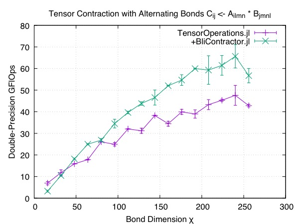
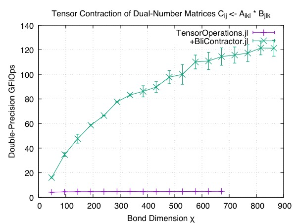

# BliContractor.jl

[![CI][github-img]][github-url] [![][codecov-img]][codecov-url]

[github-img]: https://github.com/xrq-phys/BliContractor.jl/workflows/CI/badge.svg
[github-url]: https://github.com/xrq-phys/BliContractor.jl/actions?query=workflow%3ACI
[codecov-img]: https://codecov.io/gh/xrq-phys/BliContractor.jl/branch/master/graph/badge.svg
[codecov-url]: https://codecov.io/gh/xrq-phys/BliContractor.jl

> Fast tensor contractor for Julia, based on TBLIS, with high-order AD and Stride support, within 400† lines. <br />
> † Result may vary as more dispatch rules are added.

- All these are made possible thanks to [TBLIS](https://github.com/devinamatthews/tblis);

## Installation

```
] add BliContractor
```
This will link the Julia package against TBLIS library vendored by `tblis_jll`.

If one wants to use their own TBLIS build, specify their TBLIS installation root
 with `export TBLISDIR=${PathToYourTBLIS}`, start Julia and run:
```
] build BliContractor
```
BliContractor.jl will be relinked to use the user-defined TBLIS installation.
Build steps as well as environment specification needs to be done *only once*.

## Usage

### From TensorOperations.jl

My implementation now contains necessary overriding of [TensorOperation.jl](https://github.com/Jutho/TensorOperations.jl)'s CPU backend method. One can directly invoke the `@tensor` macro (or the `ncon` function, etc.) and reach TBLIS backend.

```julia
using TensorOperations
using BliContractor

A = rand(10, 10, 10, 10);
B = rand(10, 10, 10, 10);
C = ones(10, 10, 10, 10);
@tensor C[i, a, k, c] = A[i, j, k, l] * B[a, l, c, j]
```

Supported datatypes are `Float32, Float64, ComplexF32, ComplexF64, Dual{N, Float32}` and `Dual{N, Float64}`. See also below for AD support.

### As Standalone Package

The simplest API is given by `contract`:
```julia
using BliContractor
using ForwardDiff: Dual
At = rand( 6, 4, 5) * Dual(1.0, 1.0);
Bt = rand(10, 5, 4) * Dual(1.0, 0.0);
contract(At, "ikl", Bt, "jlk", "ij")
# or equivalently:
contract(At, Bt, "ikl", "jlk", "ij")
```
Index notation here is the same as TBLIS, namely the Einstein's summation rules. This `contract` (with exclamation mark `!`) is also the only subroutine with [Zygote](https://github.com/FluxML/Zygote.jl)'s backward derivative support (while all subroutines in this module supports [ForwardDiff](https://github.com/JuliaDiff/ForwardDiff.jl)'s forward differential).

If one's having destination tensor `C` preallocated, a `contract!` routine (which is
 in fact called by `contract`) is also available:

```julia
Ct = zeros(6, 10) * Dual(1.0, 0.0);
contract!(At, "ikl", Bt, "jlk", Ct, "ij")
```

Tensors can be `Array`s or strided `SubArray`s:
```julia
Aw = view(At, :, 1:2:4, :);
# Unlike the case of BLAS,
# first dimension is not required to be 1 for performance to be nice:
Bw = view(Bt, 1:2:10, :, 1:2:4);
Cv = zeros(6, 5) * Dual(1.0, 0.0);
contract!(Aw, "ikl", Bw, "jlk", Cv, "ij")
```

## Roadmap

- [ ] Explicitly dispatch mixed multiplication of plain values with Duals, e.g. `(Float64, Dual{Tag, Float64})` or `(Dual{Tag, Float64}, Dual{Tag, Dual{Tag, Float64}})`, though they are already available via type conversion;
- [x] Let it play well with [Zygote.jl](https://github.com/FluxML/Zygote.jl), to at least 1st order;
- [x] Enable 2nd order pullback for Zygote.jl.

## On 2nd Derivative with Zygote.jl
Second derivative through `hessian` is already working on Zygote.jl's `master` branch, but taking `pullback` 2 times requires something more which is currently only available in the upstream development branch:
[**DhairyaLGandhi/Zygote.jl**/`dg/iddict`](https://github.com/DhairyaLGandhi/Zygote.jl/tree/dg/iddict).

## Performance

Here are two benchmark reports collected on the following system:

- Processor Model: Intel® Xeon® Platinum 8260
- SIMD Width: 512bits (AVX512)
- FP Pipelines: 2 AVX512 pipelines per core
- Frequency Throttling: Yes, even on serial execution.
- Basic Clock-Frequency: 2.40GHz
- OS: CentOS Linux 7
- Julia: 1.5.2 (official)
- OpenMP # of Threads: 4

### GEMM-Incompatible Contractions

A contraction which can not be handled by BLAS' GEMM routines is tested to show superiority of TBLIS over blocked-GEMM calls launched by TensorOperations.jl.



### Generic Strided Tensors

Generic-strided tensors are directly supported by TBLIS while in TensorOperations.jl they fall back to hand-written loops without BLAS assembly call.
 Tensor entries in this test has datatype `ForwardDiff.Dual{<:Any, Float64, 1}`, which mean that the each variable part (value or 1st differential) is stored with 1-element skip within each "column" (`A[:, l, m, n]`) of the tensor, forming a generic-strided storage.



